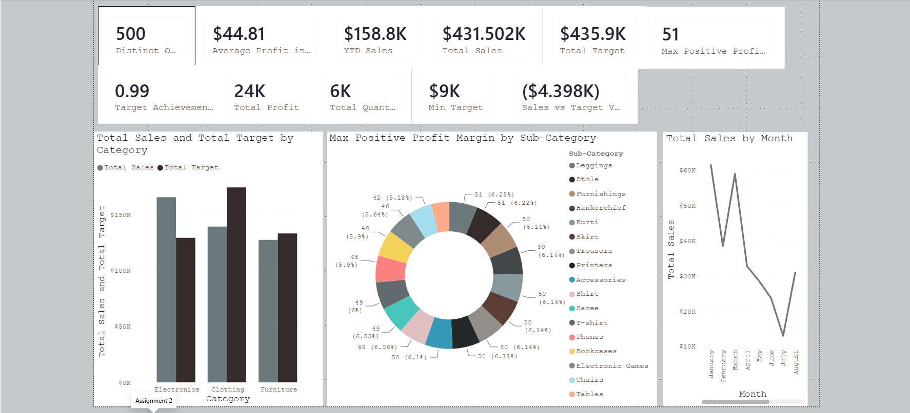
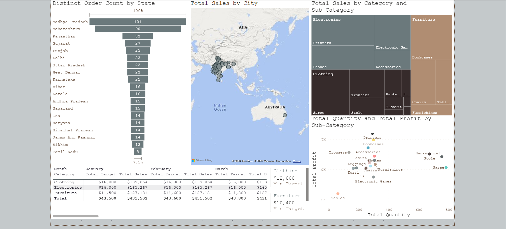

# E-Commerce Sales Analysis — Power BI Dashboard

An interactive Power BI dashboard built on an e-commerce sales dataset, using DAX (Data Analysis Expressions) to generate business metrics and a set of visualizations to analyze sales trends, profitability, and performance against targets.

This project was built as part of a Data Analytics module covering **DAX calculations** and **data visualization** in Power BI.

## Dashboard Preview





## Dataset

The report is built on three related tables:

| Table | Attributes |
|---|---|
| **List of Orders** | Order ID, Order Date, Customer Name, City, State, Category, Amount, Profit |
| **Order Details** | Order ID, Category, Sub-Category, Quantity, Amount, Profit |
| **Sales Target** | Category, Month of Order Date, Target |

## Calculated Columns

| Column | Table | Description |
|---|---|---|
| `Category Type` | Order Details | Concatenates `Category` and `Sub-Category` into a single descriptive field |
| `Revenue per Order` | Order Details | `Amount * Quantity` — computes revenue per order line |
| `Sales Category` | Order Details | Flags each order as "Above Average" or "Below Average" based on `Amount` vs. the overall average |

## DAX Measures

| Measure | Formula | Description |
|---|---|---|
| `Order Count` | `COUNT('Order Details'[Order ID])` | Total number of orders |
| `Average Profit in Delhi` | `CALCULATE(AVERAGE('Orders Data'[Profit]), 'Orders Data'[City] = "Delhi")` | Average profit for orders placed in Delhi |
| `YTD Sales` | `TOTALYTD([Total Sales], 'List of Orders'[Order Date])` | Cumulative sales from the start of the calendar year to the current date in context |
| `Total Sales` | `SUM(Order_Details[Amount])` | Total sales amount |
| `Total Target` | `SUM('Sales_target'[Target])` | Total sales target |
| `Total Profit` | `SUM('Order Details'[Profit])` | Total profit |
| `Total Quantity` | `SUM('Order Details'[Quantity])` | Total units sold |
| `Min Target` | `MIN('Sales_target'[Target])` | Minimum monthly target recorded per category |
| `Max Positive Profit Margin` | `CALCULATE(MAX('Order Details'[Profit Margin]), 'Order Details'[Profit Margin] > 0)` | Highest positive profit margin per sub-category |
| `Target Achievement %` | `DIVIDE([Total Sales], [Total Target], 0)` | Sales performance vs. target, as a ratio |
| `Sales vs Target Variance` | `[Total Sales] - [Total Target]` | Absolute gap between actual sales and target |

## Visualizations

| Visual | Chart Type | Purpose |
|---|---|---|
| Sales Target Achievement by Category | Clustered Column Chart | Compares actual sales vs. target for each product category |
| Max Profit Margin by Sub-Category | Donut Chart | Shows the highest profit margin achieved within each sub-category |
| Monthly Sales Trend | Line Chart | Tracks total sales over time to reveal seasonal patterns |
| Comparison of Profit and Quantity by Sub-Category | Scatter Chart | Plots quantity sold against profit to spot high-volume/low-margin outliers |
| Total Sales vs. Target | Cards + Multi-row Card | Quick-glance KPIs, plus minimum target per category |
| Sales Performance Matrix | Matrix | Cross-tabulates sales vs. target by category and month |
| Geographic Sales Analysis | Map (bubble) | Plots total sales by city to identify regional patterns |
| Sales Distribution by Sub-Category | Treemap | Visual ranking of sub-categories by total sales |
| Order Count Analysis by State | Funnel Chart | Ranks states by total order count |

## Implementation Steps

1. **Data Import**
   - Load `List of Orders`, `Order Details`, and `Sales Target` into Power BI (`Get Data → Excel/CSV`).

2. **Data Modeling**
   - Set correct data types for all columns (dates as Date, numeric fields as Decimal/Whole Number — watch for columns that import as Text).
   - Create relationships:
     - `List of Orders[Order ID]` (1) → `Order Details[Order ID]` (many)
     - `Order Details[Category]` → `Sales Target[Category]`
     - `List of Orders[Order Date]` (formatted to match) → `Sales Target[Month of Order Date]`, for month-level target comparisons.

3. **Calculated Columns**
   - Add `Category Type`, `Revenue per Order`, and `Sales Category` to the `Order Details` table via **Table view → New Column**.

4. **DAX Measures**
   - Create all measures listed above via **Modeling → New Measure**, organized under a dedicated `Calculated Measures` table for easier management.

5. **Build Visualizations**
   - Insert each visual type from the Visualizations pane and map the relevant fields/measures as detailed in the table above.
   - For the Map visual: enable it via `File → Options and settings → Options → Global → Security → Map and Filled Map Visuals`, and set the `City` column's Data Category to **City** for reliable geocoding.

6. **Formatting & Layout**
   - Apply a consistent theme/font across all visuals (`View → Themes → Customize current theme`).
   - Add titles, axis labels, and tooltips for clarity.
   - Arrange visuals into a single-page dashboard layout with KPI cards at the top and detailed charts below.

7. **Validation**
   - Cross-check measure outputs against raw data (e.g., verify `Average Profit in Delhi` by manually filtering and averaging in the source table).
   - Confirm chart types match the intended analysis (e.g., time-based trends use line charts, part-to-whole uses treemap/donut).

## Tools Used

- **Power BI Desktop**
- **DAX** (Data Analysis Expressions)
- Data sources: CSV (`List_of_Orders.csv`, `Order_Details.csv`, `Sales_target.csv`)

## File Structure

```
├── README.md
├── images/
│   ├── dashboard-overview.png
│   └── dashboard-details.png
└── PowerBI_Assignment.pbix
```

## Key Insights

- Some product sub-categories (e.g., Tables) show negative profit even at their best-performing orders, indicating a pricing or cost issue worth investigating.
- Sales are heavily concentrated in a handful of states (Madhya Pradesh, Maharashtra), suggesting an opportunity for expansion in lower-performing regions.
- Overall Target Achievement sits just under 100%, with Electronics outperforming its target while Clothing and Furniture fall short.
